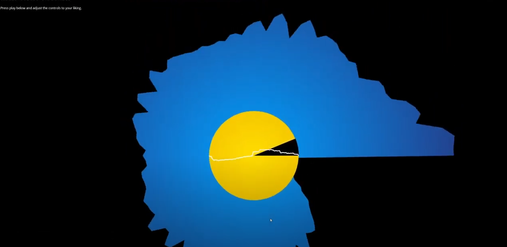

# Radial Audio Visualizer

YouTube demo: https://www.youtube.com/watch?v=inICloQq1C4&

# Citations

IM Reverbs Pack from voxengo.com at https://www.voxengo.com/impulses/

Dream Sweet in Sea Major by Miracle Musical at https://www.youtube.com/watch?v=uxyM7vhU0uU

# Log

|   Date   | Description                                                                                                                                                            |
|:--------:|------------------------------------------------------------------------------------------------------------------------------------------------------------------------|
| 10/18/20 | Created repo                                                                                                                                                           |
| 10/19/20 | Created radial audio visualizer polygon                                                                                                                                |
| 10/20/20 | Created average power circle and implemented previous bitmap operations and audio filters                                                                              |
| 10/21/20 | Created grayscale and tint effects. Added Track upload option for playing any sounds                                                                                   |
| 10/22/20 | Created sepia effect. Added noise amount slider                                                                                                                        |
| 10/23/20 | Created reverb effect. Created waveform visualizer. Optimized scripts                                                                                                  |
| 10/25/20 | Refined CSS. Made the frequency polygon start drawing points from the average frequency radius. Created void circle progress indicator. Added the all-powerful favicon |
